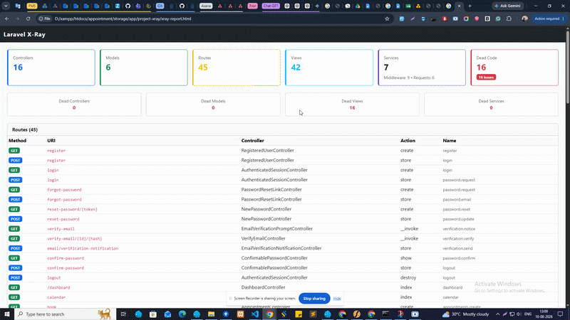

# Laravel X-Ray

[]()
[]()
[]()
[]()

Understand large Laravel applications at a glance. X-Ray statically scans your
source code — without executing it — and reports on controllers, models, routes,
views, services, middleware, and form requests, detecting dead code and mapping
dependency relationships.

## Result



## Features

- Project health scan with component counts and dead code metrics
- Controller dependency trees in the terminal and as Mermaid diagrams
- Dead code detection for controllers, models, views, and services/repositories
- Route analysis — named routes, prefixed groups, `resource` / `apiResource` expansion
- Model relationships, middleware `handle()` signatures, form request rule fields
- Per-controller complexity metrics (method count, lines of code)
- JSON, Markdown, Mermaid, and self-contained HTML reports

## Requirements

- PHP 7.4 – 8.4
- Laravel 8 – 12

## Installation

```bash
composer require jaydeep/laravel-xray
php artisan vendor:publish --tag=xray-config
```

The service provider is auto-discovered. If auto-discovery is disabled, register
it manually in `config/app.php`:

```php
Jaydeep\Xray\LaravelXrayServiceProvider::class,
```

## Commands

| Command | What it does |
|---------|--------------|
| `xray:scan` | Full health scan — terminal summary, plus an HTML report on every run |
| `xray:architecture` | Controller dependency trees and detected layers (class analyzers only, so it's fast) |
| `xray:deadcode` | Unused controllers, models, views, and services |
| `xray:report` | Writes report files with no interactive output — for CI and scheduled runs |

```bash
php artisan xray:scan
php artisan xray:scan --save                    # also write JSON + Markdown
php artisan xray:architecture --mermaid --save
php artisan xray:deadcode --json
php artisan xray:report --format=all
php artisan xray:scan --path=/var/www/other-project
```

| Option | Available on | Description |
|--------|--------------|-------------|
| `--json` | scan, architecture, deadcode | Print the result as JSON to stdout |
| `--save` | scan, architecture, deadcode | Write report files to `output_path` |
| `--mermaid` | architecture | Print the Mermaid diagram (saves only with `--save`) |
| `--format=` | report | `json`, `markdown`, `mermaid`, `html`, or `all` (default) |
| `--path=` | all | Override the base path used to resolve scan directories |

Dependency trees are rendered with box-drawing characters:

```
  UserController
  ├── UserService
  │   └── UserRepository
  └── MailService

  Detected Layers
  Controller -> Service -> Repository
```

## Output files

Everything is written to `output_path` (default `storage/app/project-xray`):

| File | Written by | Contents |
|------|-----------|----------|
| `xray-report.html` | `xray:scan` (always), `xray:report` | Self-contained Bootstrap 5 dashboard — stat cards, dead code, routes table, dependency tree, model relationships |
| `scan-report.json` | `xray:scan --save`, `xray:report` | Full scan data — components, architecture, dead code, summary |
| `scan-report.md` | `xray:scan --save`, `xray:report` | Markdown report, good for pull requests |
| `architecture.json` | `xray:architecture --save`, `xray:report` | Dependency `trees` and `layers` only |
| `architecture.mmd` | `xray:architecture --save`, `xray:report` | `graph TD` flowchart + `classDiagram`, renderable on GitHub, GitLab, or [mermaid.live](https://mermaid.live) |
| `deadcode.json` | `xray:deadcode --save`, `xray:report` | Dead code results only |

## Configuration

`config/xray.php`:

| Key | Default | Purpose |
|-----|---------|---------|
| `paths.controllers` | `app/Http/Controllers` | Controller files |
| `paths.models` | `app/Models` | Eloquent model files |
| `paths.services` | `app/Services` | Service class files |
| `paths.repositories` | `app/Repositories` | Repository class files |
| `paths.views` | `resources/views` | Blade templates |
| `paths.routes` | `routes/` | Route files (`web.php`, `api.php`, …) |
| `paths.middleware` | `app/Http/Middleware` | Middleware files |
| `paths.form_requests` | `app/Http/Requests` | Form Request files |
| `output_path` | `storage/app/project-xray` | Where reports are saved (created if missing) |
| `ignore` | `['Controller.php']` | File basenames excluded from every analyzer |

Each path must be an absolute directory — use `app_path()`, `base_path()`,
`resource_path()`, or a plain string. Subdirectories are scanned recursively, so
non-standard or modular layouts just need the right parent:

```php
'paths' => [
    'controllers'  => base_path('src/Http/Controllers'),
    'models'       => base_path('src/Domain/Models'),
    'services'     => base_path('src/Domain/Services'),
    // ...
],
```

Add abstract base classes to `ignore` to keep them out of dead code results:

```php
'ignore' => ['Controller.php', 'BaseService.php', 'BaseRepository.php'],
```

## Dead code detection

| Type | Reported when the short class / view name is… |
|------|-----------------------------------------------|
| Controllers | Not referenced by any parsed route |
| Models | Not found in the content of any other scanned class or route file |
| Views | Not found via `view()`, `View::make()`, `@include`, `@extends`, or `@component` |
| Services / Repositories | Not a constructor dependency anywhere, and not present in any other class's content |

> **Detection is heuristic — always verify before deleting.** Common false
> positives: models used only through `DB::table()` or raw queries, dynamically
> built view names (`view('emails.' . $template)`), services injected by
> interface, and code outside the configured scan paths.

## CI and scheduling

```yaml
- name: Generate X-Ray reports
  run: php artisan xray:report --format=all

- uses: actions/upload-artifact@v3
  with:
    name: xray-reports
    path: storage/app/project-xray/
```

```php
// app/Console/Kernel.php
$schedule->command('xray:report --format=all')->weekly();
```

## Troubleshooting

| Problem | Solution |
|---------|----------|
| "No controllers detected" | Check the resolved path: `php artisan tinker` → `config('xray.paths.controllers')` |
| Command not found | Run `php artisan package:discover`, or register the provider manually |
| Empty Mermaid diagram | No controller has typed constructor dependencies to graph |
| Reports not saved | `output_path` is not writable — `chmod -R 775 storage/` |
| `--path=` has no effect | Supply an absolute path, and ensure `Http/Controllers` etc. exist beneath it |
| Scan fails with a PHP error | A scanned file has a syntax error — X-Ray uses `token_get_all()`, which needs valid PHP |

## Testing

```bash
composer install
./vendor/bin/phpunit
```

## License

MIT © [Jaydeep Gadhiya](https://packagist.org/packages/jaydeep/laravel-xray)
